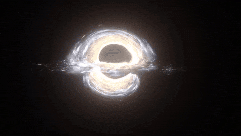
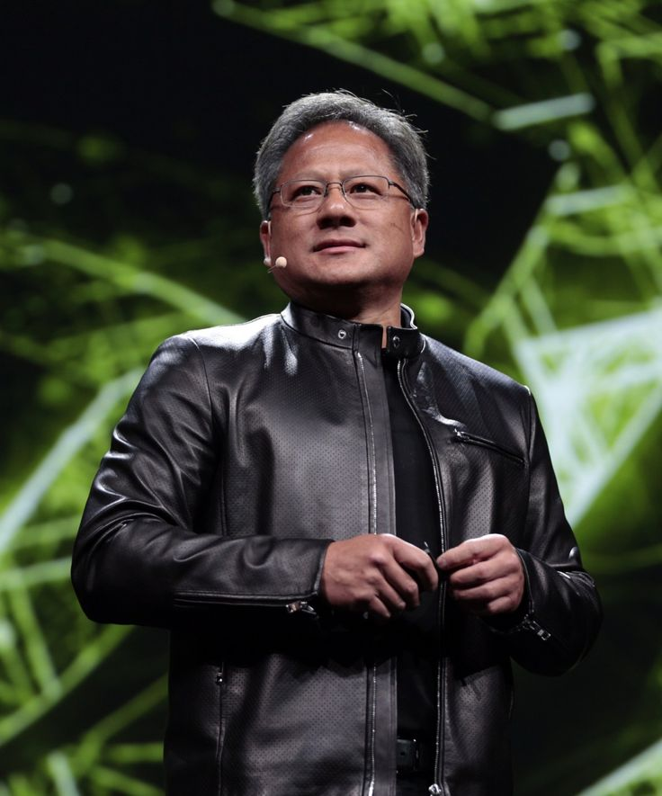

<div align="center">
  

  <h1>Hello, TON is here!!!</h1>
  <h2>Fathir Rizki Fadillah</h2>

  <p>Machine Learning | Deep Learning | Data Analytics | Arduino</p>

  <h5>My Social Network:</h5>

  <p>
    <a href="https://www.linkedin.com/in/fathir-rizki-fadillah-8931b931b/">
      
    </a>
    <a href="mailto:fathirrf80@gmail.com">
      
    </a>
    <a href="https://instagram.com/frzkifadillah">
      
    </a>
    <a href="https://www.kaggle.com/fathirrizkifadillah">
      
    </a>
  </p>
</div>

---

### My Favorite Game :

<p>
  
  
  
  
  
  
  
  
  
  
</p>

---

### Streakkk :

<p align="center">
  ">
</p>

---

### Recent Activity

<!--START_SECTION:waka-->

```txt
Markdown   1 hr 23 mins          ████████████████▓░░░░░░░░   66.33 %
Python     34 mins               ██████▓░░░░░░░░░░░░░░░░░░   27.29 %
Other      7 mins                █▓░░░░░░░░░░░░░░░░░░░░░░░   06.18 %
YAML       0 secs                ░░░░░░░░░░░░░░░░░░░░░░░░░   00.20 %
```

<!--END_SECTION:waka-->

---

### Companies I follow

<p>
  
  
  
  
  
  
  
  
  
  
</p>

---

### News Sources I Follow

<p>
  
  
  
  
  
  
</p>

---

### My Idol 😎💪

<p>

</p>

Jensen Huang
Founder & CEO of NVIDIA

  
</p>
